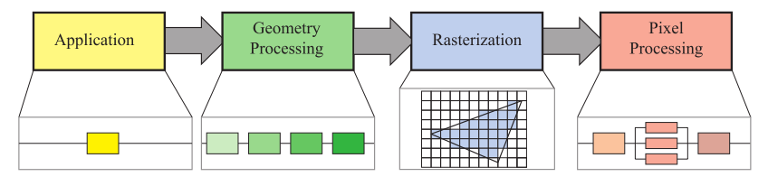
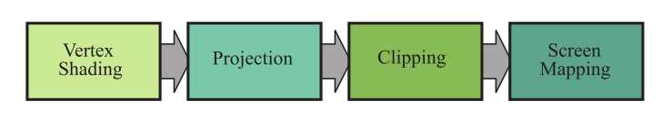
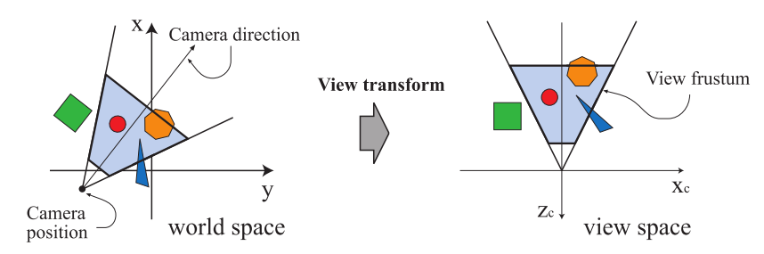
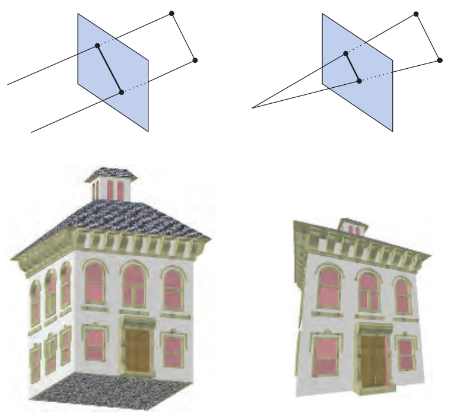
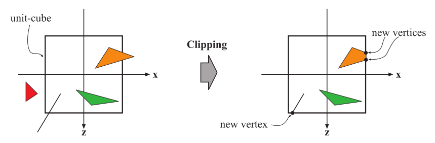
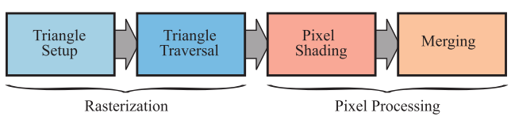

[TOC]

### 架构

粗糙地将图形绘制管线划分为4个阶段：

- 应用程序阶段；
- 几何处理阶段；
- 光栅化阶段；
- 像素处理阶段。

|      |
| :--------------------------: |
| 图2.2 图形绘制管线的基本组成 |

注意：绘制管线的这些阶段有可能自身就是一个管线化结构（比如几何处理阶段），同时有些管线阶段自身可以（部分）并行（比如像素处理阶段）。图中的应用程序阶段看似是单独的处理，但其同样可以是管线化的或者并行化的（比如多线程）。

各个阶段的主要任务可以简单总结如下：

- 应用程序阶段：应用逻辑的处理，同时也包括碰撞检测、全局加速算法、动画以及模拟等；
- 几何处理阶段：包变换、投影以及其他几何操作；
- 光栅化阶段：通常输入三个顶点，形成一个三角形，并计算哪些像素在这个三角形内部；
- 像素处理阶段：在每个像素执行程序，用于计算像素的最终颜色值，也会执行深度测试以及混合。

### 应用程序阶段

开发人员对应用程序阶段有完全控制权。同时，一些应用程序的功能，也可以由GPU帮助实现，比如通过计算着色器（$compute\ shader$）。

在应用程序阶段结束之时，会将需要渲染的几何对象送往几何处理阶段，他们被称为渲染图元（$rendering\ primitives$），比如：点、线、三角形等。

在应用程序阶段通常会实现一种名为碰撞检测（$collision\ detection$）的技术。在检测到两个物体之间发生碰撞后，可能会为两个物体产生碰撞响应并反馈给碰撞物体以及力反馈装置。应用程序阶段也通常会处理其他输入，比如键盘、鼠标等。加速算法，比如某些特定的剔除算法也会在这一阶段实现。

### 几何处理

几何处理阶段发生在GPU上，负责了绝大部分的per-triangle和per-vertex操作。这一阶段被进一步划分成如下四个功能阶段：

|       |
| :---------------------------: |
| 图2.3 几何处理阶段的4个子阶段 |

#### Vertex Shading（顶点着色阶段）

顶点着色阶段有两个主要的任务：1.计算一个顶点的位置；2.计算程序员需要顶点输出的结果（比如法线、纹理坐标等）。传统上，对于一个物体的光照计算是在顶点着色器阶段进行。这些计算得到的颜色值再通过光栅化插值得到每个三角形的颜色。也正是因为这个原因，顶点着色器由此得名。随着现代GPU的发展，所有的着色任务都由发生在每个片段上了，顶点着色阶段的功能也因程序员的意图而越发通用了，它更现在倾向与是一个更通用的处理单元，专门设置与每个顶点关联的数据。

首先，介绍顶点的位置是如何计算的。当一个模型被渲染到屏幕上时，它将经历若干个空间$space$或者叫做坐标系统$coordinate\ systems$。模型通常在自己的物体空间$model\ space$中，这意味着它并没有经过任何坐标变换。每一个模型都经由一个模型变换矩阵来确定在世界坐标中的具体位置和朝向。对于同一个模型应用多个变换矩阵是有可能的，这也就是在同一个场景中，在不重复基本几何信息的情况下，使得同样的模型有着不同的位置、朝向、大小等（也就是实例$instances$渲染）。

模型自身所处的坐标系统叫做模型坐标$model\ coordinates$，当经过模型变换（乘上模型矩阵）以后，模型也就相当于处于世界坐标（$world\ coordinates$或者$world\ space$）中了。世界坐标系是独一无二的。当场景中所有的模型都经过模型变换后，他们都处在同一个世界坐标系下了。

如同之前提到的，只有摄像机看到的模型才会被渲染。摄像机处在世界空间中，并且有一个观察的朝向。为了进行投影和裁剪，需要进行观察变换（$view\ transform$）。其目的是为了在经过观察变换（乘以观察矩阵）以后，将摄像机置于坐标系的原点位置，且朝向复$z$轴的方向（这个坐标系被称为观察空间$camera\ space$ 或者$view\ space$或者$eye\ space$）。在经过观察变换后，摄像机的具体位置和朝向是依赖于底层API的实现的。具体参见如下图示：

|                                      |
| :----------------------------------------------------------: |
| 图2.4 左边的俯视图展示了摄像机在世界坐标系下的位置和朝向。经过观察变换以后，如右图所示，摄像机处在了坐标系的原点处，且观察方向朝向负$z$轴方向。经过这一变换后，后续的投影和裁剪操作将变得简单且迅速。图中，我们考虑的是透视投影，因此蓝色区域是视锥体，但是相似的技术可以应用在任何的投影上。 |

接下来，考虑顶点着色器输出的第二类输出。为了展现真实的场景，除了要把物体的形状位置渲染出来，还需要将其具体外观展现出来。这些包括了物体的材质以及任何光源照射在物体表面的反应。我们通过着色（$shading$）来表现光照射在材质上的反应。

着色通常是对物体上的多个点计算渲染方程（$shading\ equation$）的结果得到的。这些计算过程有些在顶点处理阶段完成，有的在片元处理阶段完成。需要用于计算渲染方程的大部分材质的数据，比如点的位置、法线、颜色都可以存储在顶点中，顶点着色的结果随后被送往光栅化和片元处理阶段。这些结果被插值后再在片元处理阶段用于计算着色结果。

在顶点着色阶段，还将进行投影（$projection$）和裁剪（$clipping$）操作，这将会把视锥体转变成一个单位立方体，立方体的坐标范围是（-1， -1， -1）到（1，1，1）。当然也有不同的坐标范围，比如有的API实现，将$z$轴的范围定在了$0 \leqslant z \leqslant 1$，但不论他们所定义的坐标范围如何，他们均代表了相同的视锥体。

首先进行的是投影操作，这是通过GPU上的顶点着色器完成。通常有两种投影方式：正交投影（$orthographic$或者$parallel$）以及透视投影（$perspective$）。图2.5展示了这两种投影方式。除此以外，还有其他的投影方式，比如斜投影和轴测投影（$oblique\ and\ axonometric\ projections$）等。

|                |
| :------------------------------------: |
| 图2.5 左图，正交投影；右图，透视投影。 |

正交的视角得到的视锥体通常是一个长方形的盒子，正交投影将这个视锥体转换成单位立方体。正交投影的主要特点是，两条平行线在经过投影后仍然是平行的。正交投影主要是做了变换和缩放操作。

透视投影则更加复杂。在这类投影情况下，物体距离摄像机越远，在投影操作后越小。同时，相互平行的两条线将会在地平线（即无穷远处）相交。也就是说，透视投影模仿了我们感知物体大小的方法。在透视投影下，视锥体仍被转换成一个单位立方体。

正交投影和透视投影均可以通过$4 \times 4$的投影矩阵完成，一旦经过投影，模型也就位于裁剪坐标系（$clip\ coordinates$）下了。这个坐标系是一个齐次坐标系。

这些投影矩阵将一个立方体转换成另一个立方体，他们为什么被称为投影是有原因的。在经过这一步骤后，$z$坐标，被存储在$z-buffer$中了，而非生成的图像中，因此模型从3维空间中投影到2维空间中。

#### 可选的顶点处理阶段

除了前面讨论的顶点着色阶段，还有另外的可选顶点处理阶段，他们依次是：细分（$tessellation$）、几何着色（$geometry\ shading$）以及流输出（$stream\ output$）。他们的使用要依赖于硬件（并非所有的硬件都支持这些）和程序员的意愿。

第一个可选阶段是细分阶段。假定你有一个弹跳球模型，你使用一组三角形表示这个模型。你的弹跳球可能在5米开外看起来还不错，一旦你走进观察就会发现三角形的边缘变得清晰可见了。如果你使用更多的三角形来表示这个弹跳球，以期望能提高质量，那么当弹跳球只覆盖了屏幕上极少部分像素的时候，你将不得不浪费掉大量处理时间和内存资源。使用细分，可以用恰当数量的三角形表示曲面。

下一个可选阶段是几何着色器（$geometry\ shader$）。它和细分着色器相似之处在于，它的输入是各类的图元，并可能产生新的顶点。它也有被限制的地方：生成的新的顶点被限制在一定范围内，同时输出图元的类型也是有限的。

几何着色器最基本的作用是用于生成粒子。想象模拟烟花爆炸的过程。每一个烟花球都可以由一个点表示。几何着色器将每一个点作为输入，并输出一个面向观察者的四方形（由三角形构成），这样可以提供一个更加好（a more convincing primitive）的图元以供我们进行渲染。

最后一个可选阶段是流输出阶段。在这一阶段，我们可以选择性地将处理过后的顶点输出到一个数组中，以供后续处理，而不是直接送往图形管线的剩余部分直接渲染。

这三个可选阶段的执行顺序是：细分、几何着色、流输出。不管哪些可选阶段被执行，我们都有了处在齐次坐标系下的顶点，这些将会进一步被检测是否会被摄像机看到。

#### 裁剪

只有全部或部分处在视锥体内的图元才需要被送往光栅化阶段进行随后的处理。如果图元整个处在视锥体内，它将会被送往图形管线的其余部分继续处理；如果图元整个都不在视锥体内，它将会被直接丢弃；如果图元部分处在视锥体内，它将需要被裁剪。比如一条线段，其中一个顶点处在视锥体内，另一个在视锥体外，那么处在外部的顶点将被新的顶点取代，这个顶点就是这条线段与视锥体相交的那个点。在裁剪之前，先进行观察变换以及投影操作的优势在于，这将使得裁剪问题变得统一：图元都是相对于单位立方体进行裁剪的。

裁剪的图示如下图所示：

|  |
| :----------------------: |
|   图2.6 裁剪过程的图示   |

裁剪阶段将投影阶段提供的4维其次坐标作为输入，最后执行透视除法（$perspective\ division$），将三角形的顶底转换到3维的标准化设备坐标系（$normalized\ device\ coordinates$）中。

#### 屏幕映射

只有在视锥体内的图元（包括裁剪后的）才会被送往屏幕映射阶段。在进行屏幕映射之前，坐标系仍然是三维的。每个图元的$x$轴和$y$轴被转换到屏幕坐标系下，同时$z$轴也在屏幕坐标系（$screen\ coordinates$）下。假定需要将场景渲染到一个范围在$(x_1,y_1)$和$(x_2,y_2)$的窗口中，其中$x_1<x_2$并且$y_1<y_2$。屏幕映射也就是一种变换和缩放操作。新的$x$和$y$坐标被称为屏幕坐标，$z$坐标（在OpenGL中是$[-1,1]$，在Direct3D中是$[0,1]$）被映射到$[z_1,z_2]$。这些新的坐标将被送往光栅化阶段进行进一步的处理。

### 光栅化阶段

给定经过变换和投影以后的顶点以及他们的相关计算最终颜色相关的信息，我们需要找到所有的在图元内部的像素（$pixel, short\ for\ picture\ elements$），比如图元是三角形，我们需要根据三角形的三个顶点计算哪些像素在这三个顶点内部。这个过程叫做光栅化（$rasterization$），同时被分成两个子过程：三角形建立、三角形遍历，如图2.8所示。注意，这对点和线段同样适用。光栅化，也被称作扫描转换（$scan\ conversion$），是从二维的顶点转换到屏幕上的像素的过程。光栅化也可以看作几何处理阶段和像素处理阶段的同步点，因为从这里开始，三角形最终被传递至片段处理阶段。

|                                    |
| :--------------------------------------------------------: |
| 图2.7 左侧蓝色部分是光栅化的两个子过程，右侧是像素处理过程 |

决定一个三角形是否覆盖住像素需要看你怎么设置图形管线的。比如，你可以使用点采样来决定。最简单的情况是使用每个像素的中心点作为采样点，如果这个中心点位于三角形内，那相邻的像素也被认为是处在三角形内。也可以使用超采样或者多采样抗锯齿技术，使用多个采样点来判断像素是否位于三角形内部。

#### 三角形建立阶段

在这一阶段，微分、边方程（edge equations）和其他三角形的数据将会被计算。这些计算结果将会被用于三角形遍历阶段，也会被用在对几何处理阶段产生的用于光照计算的数据的插值中。这些工作将有固定功能硬件执行。

#### 三角形遍历阶段

找到被三角形覆盖的采样点或者像素被称为三角形遍历。每一个三角形片段的信息将通过三角形三个顶点里的信息插值得到。也正是在这里，会对三角形执行投影正确的插值（perspective-correct interpolation）。所有的像素或者采样点将会被送往图形管线的下一阶段进行处理。

### 像素处理阶段

到现阶段为止，所有被认为处在三角形或其他图元内部的顶点都已经被找到。像素处理阶段被划分为像素着色（$pixel\ shading$）和合并（$merging$）阶段。在像素着色阶段，对于每个像素或者每一个采样点的计算和操作都是在这个阶段进行的。

#### 像素着色阶段

使用插值得到的数据，所有的像素着色都在此阶段进行。这一阶段由可编程GPU程序执行（也就是fragment shader），这将允许任意的计算在此进行。同时大量的技术可以在这个阶段运用，比如纹理映射（$texturing$）。

#### 合并阶段

颜色缓冲（$color\ buffer$）是一个方形的数组，里面存放了每个像素的信息。合并阶段的主要任务，就是将像素着色阶段生成的结果颜色，与现阶段存放在颜色缓冲中的颜色进行组合。不同于像素着色阶段，执行合并阶段任务的GPU子单元通常不是全部可编程的，但是它确是高度可配置的，可以实现各种效果。

这个阶段还负责解决可见性问题。这意味着：当整个场景被渲染完以后，颜色缓冲中的值应该是从视点位置可以观察到的图元的颜色。对大部分图形硬件来说，这是通过$z-buffer$（$depth\ buffer$）算法来实现的。$z-buffer$和颜色缓冲的大小一样，对于每一个像素，它存储了当前最近的图元的深度值（$z-value$）。这也就意味着，当一个图元被渲染到某个像素中时，这个图元在那个像素中的深度值，会与$z-buffer$中同样像素中存储的深度值做比较。如果新的深度值比深度缓冲中的深度值小，也就是说当前正在渲染的图元在那个像素要更靠近摄像机一些。因此，在那个像素位置的深度值和颜色值都将被更新。$z-buffer$算法很简单，且有$O_{(n)}$的复杂度（$n$代表正在被渲染的图元的数目）。同时需要注意，这种算法允许大部分图元以任意顺序进行渲染。但是，深度缓冲只存储了单一深度值，因此它不能被用于渲染局部透明物体。对于此类物体，必须等所有不透明物体被渲染完以后才能被渲染，并且需要以“从后往前”的顺序进行渲染，否则则只能使用其他顺序无关的算法进行渲染。

除了颜色缓冲和深度缓冲以外，还有通道和缓冲可以用于存储片元信息。和颜色缓冲关联在一起的$\alpha$通道（$\alpha \ channel$）用于存储每个像素的相对透明度。在老旧的API中，也可以通过$\alpha$测试来选择性地丢弃部分像素。现如今，丢弃操作可以被插入片段着色器中，且任何类型的计算都可以用于触发丢弃操作。

模板缓冲（$tencil\ buffer$）是一个离屏缓冲，它被用于记录被渲染图元的位置。通常每个像素包含8位。图元可以经由各种函数被渲染进模板缓冲中，缓冲中的内容随后被用于控制渲染进颜色缓冲和深度缓冲中。举个例子，假设有一个实心圆被渲染进了模板缓冲中。This can be combined with an operator that allows rendering of subsequent primitives into the color buffer only where the circle is present. 对于生成一些特殊的效果，模板会是一个强大的工具。管道末端的所有这些函数都称为光栅操作（$ROP, raster\ operations$）或混合操作（$blend\ operations$）。混合通常是通过API来配置的，而并非完全可编程的。

帧缓冲（$framebuffer$）通常包含了所有的缓冲。

当图元通过了光栅化阶段以后，那些可以被从摄像机视点看到的就可以被显示到屏幕上了。屏幕显示了颜色缓冲区中的内容。为了防止人眼看到当前正在被渲染送去显示的图元，通常会使用双缓冲（$double\ buffering$）技术。这意味着场景的渲染在后缓冲区（$back\ buffer$）的屏幕外进行。一旦后缓冲中渲染结束后，后缓冲中的内容将会被交换到前缓冲（$front\ buffer$）中。这种交换通常发生在垂直回扫（$vertical\ retrace$）期间。