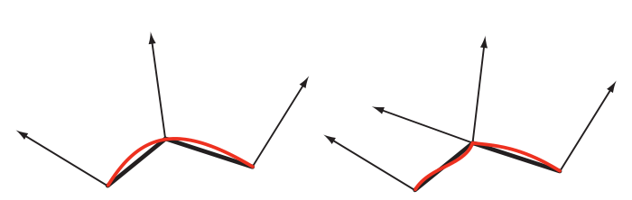
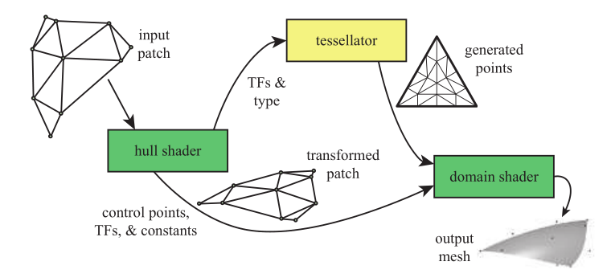
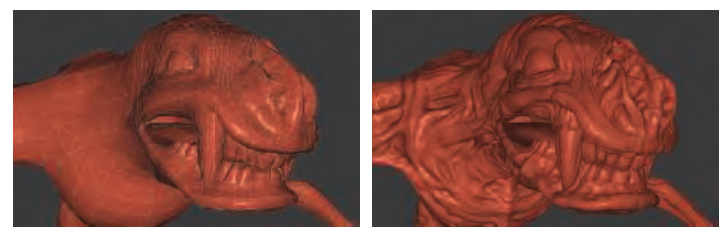
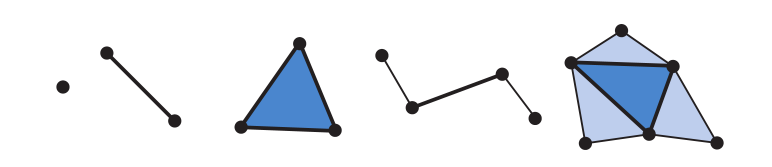
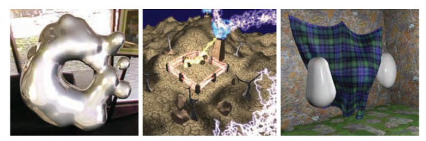
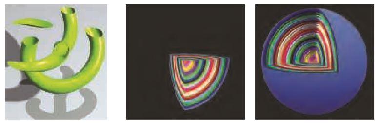

# 图形处理单元

[TOC]

## 引言

从颜色插值，显示到访问纹理数据，内建的`z-depth`可见性检查，越来越多的加速特性被添加到图形硬件中。专用的加速图形硬件和CPU相比的优势只在于速度，而速度对于图形处理来说是至关重要的。

在过去的二十年期间，图形硬件发生了巨大的变化。从固定功能管线，可配置管线到高度可编程管线，开发者可以更灵活的实现他们的算法。尽管出于效率上的考虑，管线的某些部分仍是可配置而不是可编程的，但总体的趋势朝着可编程性和灵活性迈进。

为了显著提升速度，GPU在高度可并行任务上做了相当的优化。比如，使用了定制的芯片来实现`z-buffer`,快速访问纹理，光栅化等等。下面的章节将会告诉你GPU怎么为可编程着色器实现并行化。

现在，只需要知道一个着色器核心(`shader core`)是一个小的处理器，它可以执行一些相对独立的任务，比如坐标转换。在图形处理的每帧中，有成千上万的三角形被发送到屏幕上，同时每秒也会激活上百万的着色器(`shader`)，也就是说，会产生同样数量的独立运行着色程序的实例。

首先，延迟(`latency`)是需要处理器都需要面临的问题。简单来说，信息离处理器越远，延迟越高。比如，访问内存上的数据就比寄存器的延迟高得多。要明白的一点是，由于等待数据取回造成的延迟会使得处理器被阻塞(`stalled`)，从而降低性能。

## 数据并行架构

不同的处理器架构采用不同的策略来避免拥堵。CPU被优化于处理种类广泛的数据结构和大规模的代码。尽管CPU可以有多个处理器，但每个处理器几乎是串行地运行代码，大大限制了`SIMD`的能力。

> 注：SIMD(single instruction, multiple data)指单指令多数据，是一类并行计算方式，这意味着拥有多个处理核心的处理器可以同时对多个数据执行相同的代码。

GPU采用不同的优化方法。GPU通常拥有大量的处理单元，也就是所谓的着色器核心(`shader core`)。GPU是一个流处理器，可以轮流的处理一系列相似的数据。由于数据的相似性（顶点/像素），GPU可以以大规模并行的方式去处理它们。一个关键的要素是调用要尽可能独立，数据之间不共享，否则会造成额外的延迟。

GPU专门为流量(`throughput`)进行优化，以尽可能快的处理更多数据。然而，由于更小的芯片面积限制，单个GPU的缓存和控制逻辑能力比CPU弱的多，因而对每个着色器核心来说，延迟问题也更加突出。

举个例子，当有两千个顶点需要着色时，假设GPU只有一个着色器核心，那么一个片元着色器会被调用两千次。当着色器需要执行譬如纹理获取的耗时操作时，就会被阻塞而不进行任何操作。

为了让GPU更加高效，可以给每个片元(`fragment`)的局部寄存器一点存储空间。如此，着色器就可以切换到下一个片元进行处理，而不是阻塞在当前片元上等到纹理获取完毕。重复这个过程，每当在当前片元发生耗时操作引起阻塞时，GPU立马切换到下一个片元继续工作，直到程序结束。通过切换片元的操作，可以使得GPU保持运转状态而巧妙的隐藏了延迟问题。虽然这样会使得每个片元的执行时间变长，但总体的效率却大大提升。

更进一步，GPU把指令执行逻辑从数据中分离开，以一致的步伐执行固定数量的着色程序，也就是所谓的SIMD。此外，执行相同着色程序的GPU线程被捆成一束(`warps`)，一束包含8到64个线程，使用SIMD处理的方式来进行调度。假设有两千个线程需要执行，Nvidia中的GPU中的`warps`包含32个线程，那个就会产生2000/30=62.5个`warps`。一个`warps`对一组相同数量(32个)的顶点或像素运行相同的着色程序，当遇到耗时操作发生阻塞时，`warps`就会切换到下一组顶点或像素进行处理。这要求一个`warps`的32个线程尽可能的同时处理完所有的顶点或像素，否则就会发生一个`warps`间的线程等待耗时问题。

|  |
| :-------------------------------------------------------: |
|               图 1：简化的的着色器执行例子                |

## GPU管线概览

|                |
| :----------------------------------------------------------: |
| 图 2：GPU渲染管线的实现。绿色：可编程；虚线：可选编程；黄色：可配置；蓝色：固定功能 |

如图2所示，GPU实现了第二章从概念上描述的几何处理，光栅化和像素处理管线阶段，这被划分为硬件级别的若干个阶段，每个阶段有不同程度的可配置性和可编程性。值得注意的是，上述的管线过程只是GPU的逻辑模型描述，而不一定是底层的GPU实现管线的流程，硬件层次的管线实现可能做更多的优化处理。

顶点着色器(`vertex shader`)是用来实现几何处理的完全可编程阶段。几何着色器(`geometry shader`)也是一个完全可编程的阶段，它对图元中的顶点数据进行操作，来销毁或创造新的图元。细分阶段(`tessellation stage`)和几何着色器都是可选的阶段，不一定被所有的GPU支持（特别是移动设备）。

裁剪(`clipping`)，三角形初始化和遍历(`triangle setup & traversal`)由固定管线硬件实现。屏幕映射(`screen mapping`)内部会根据窗口和视口状态进行简单的放缩和重定位操作。像素着色阶段也是完全可编程的。合并阶段支持高度配置，可以用来实现合并(`merging`)操作，比如修改颜色，z-buffer, 混合, 模板和其他跟输出相关的buffer。

## 可编程着色阶段

现代着色器程序使用了统一的设计。这意味着，顶点，像素，几何，细分相关的着色器共享着一样的编程模型和执指令集(`ISA`)，每个着色器核心可以用作不同的角色，而不是专用的像素着色器或顶点着色器。相同的编程模型使得GPU可以很好的分发任务，平衡负载。

GLSL(OpenGL)和HLSL(DX)是常见的着色器脚本语言。其中，HLSL可以被编译成中间表示的字节码。中间表示的字节码是平台无关，可以通过具体的GPU驱动转换成对应平台的ISA。

着色器支持的基本的数据类型有32位的单精度浮点数和向量。向量通常包含位置，法线，颜色等数据。整型通常用来表示索引，计数器，掩码。着色器同时也支持结构体，数组，矩阵这些聚合数据类型。

绘制调用(`draw call`)触发图形API绘制一组图元，从而使图形管线执行它的着色器。每个可编程着色器包含两种类型的输入：`uniform`输入和`varying`输入。`uniform`输入在一个`draw call`中不可改变，但可在`draw call`之间改变。`varying`输入数据来自三角形的顶点数据或者光栅化数据，是可变的输入数据。

底层的虚拟机给不同类型的输入输出提供不同的寄存器。为`uniform`提供的固定寄存器`constant register`远大于为可变的输入输出提供的寄存器。这是因为，每一个顶点或像素都需要单独存储可变的输入输出，这天然限制了这些寄存器的大小。而`uniform`输入在每一次`draw call`中只需要存储一次，并且为所有顶点或像素共享。此外，还有通用目的的临时寄存器`temporary register`。

|          |
| :----------------------------------------------------: |
| 图 3: Shader Model 4.0中的统一虚拟机架构和寄存器层次。 |

常用的操作，如加/乘/`atan()`/`log()`/矩阵乘法/归一化，在现代GPU中有着高效的实现。

if/else，loop这样的控制流(`flow control`)同样被着色器所支持。着色器支持静态控制流（基于`uniform`输入值）和动态控制流（基于`varying`输入）。静态控制流使得同样的着色器可以用在不同的场景中（如不同数量的光源），而不会导致线程分散(`thread divergence`)，因为在一个`draw call`中，固定的`unifrom`输入使得程序执行路径对每个线程来说都是固定的。动态控制流则会导致每个片元都可能以不同的程序路径执行代码，导致某些线程需要等待，并且同一个线程束的线程在等待过程中不能发生切换，影响性能。

> TIPS: 尽量避免shader中的分支语句可以提高性能。
>
> Ref: [thread divergence](https://cvw.cac.cornell.edu/gpu/thread_div)

## 可编程着色和API的发展

|  |
| :--------------------------------------------: |
|            图4: 图形API和硬件的发展            |

## 顶点着色器

顶点着色器(`vertex shader`)是图2所示渲染管线中的第一个阶段，其功能于 2001 年首次在 DirectX 8 中引入。

值得注意的是，虽然顶点着色器是第一个可编程控制的阶段，但在此阶段之前还发生了一些数据操作。比如在 DirectX 中叫做输入装配(`input assembler`)的阶段，会将一些数据流组织在一起，以形成顶点和基元的集合，发送到管线。在输入装配阶段还支持执行实例化(`instancing`)，实例化这项技术能够让我们使用一个渲染调用(`draw call`)来绘制多个物体。

一个三角形网格(`triangle mesh`)表示为一系列顶点的集合，每一个顶点与模型表面的特定位置相关联。除了位置之外，还有一些其它可选属性与每个顶点相关联，例如颜色、纹理坐标、表面法线。表面法线与顶点相关联似乎有点怪异，在数学上，每一个三角形有一个明确定义的表面法线，直接使用三角形的表面法线来进行着色计算似乎更加合理。然而，在实际进行渲染时，三角形网格通常被用来表示曲面，而顶点法线则用来表示曲面的法向，而不是表示这个三角形网格自身的法向。图5展示了两个三角形网格（用于表示曲面）的侧视图，其中一个光滑，另一个有锐痕。

|   |
| :---------------------------------------------: |
| 图5: 表示曲面（红色）的三角形网格（黑色）侧视图 |

顾名思义，顶点着色器是专门处理输入GPU渲染管线的顶点信息的着色器。顶点着色器可以对每个顶点进行诸如变换和变形在内的很多操作，提供了修改、创建、或者忽略与每个多边形顶点相关的值（例如颜色、法线、纹理坐标、位置）的方式。通常，顶点着色器程序将顶点从模型空间(`model space`)变换到齐次裁剪空间(`homogeneous clip space`)，并且，一个顶点着色器必须要输出该顶点的位置（其它顶点附加信息可以不输出）。

顶点着色器既不能创建也不能消除顶点，并且由一个顶点生成的结果不能传递到另一个顶点。由于每个顶点都被独立处理，所以GPU上的任何数量的着色器处理器都可以并行地应用到传入的顶点流上。

图6是使用顶点着色器的一些示例。

|                |
| :----------------------------------------------------------: |
| 图6: 左图，一个普通茶壶。中图，经过顶点着色程序执行的简单剪切(`shear`)操作产生的茶壶。右图，通过噪声(`noise`)产生的发生形变的茶壶。 |

顶点着色器的输出可以以许多不同的方式来使用，通常是随后用于每个实例三角形的生成和光栅化，然后各个像素片段被发送到像素着色器，以便继续处理。而在某些GPU上，数据也可以发送到细分阶段(`tessellation stage`)，或者几何着色器(`geometry shader`)，又或者存储在内存中。

## 细分阶段

细分阶段 (`tessellation stage`)是一个可选编程阶段， 该阶段于DirectX 11中首次引入，随后也被OpenGL 4.0与OpenGL ES 3.2所支持。

从本质上来讲， 细分(`tessellation`)是一种将多边形分解成更加细小的碎片以提升几何逼真度的方法。在渲染中，细分用于解决3D模型的静态属性（精细度、多边形数量）。具体来说就是当我们近距离观察一个复杂的模型（如人脸）时，我们希望能够看到这个模型的所有细节（例如皮肤的褶皱），所以我们需要使用一个高精细度的模型。一个高精细度的模型自然是需要更多的三角面以及更多的处理器资源。而当我们在稍远的距离观察这个模型的时候，我们更愿意使用一个精细度比较低的模型使得更多的计算机资源能够用于对离相机更近对象的渲染。这个技术简单来说就是用于平衡 GPU 资源，使得更多的资源能够用于距离相机很近的对象的渲染，因为这些地方的小细节是很容易被用户注意到的。同时，使用这一技术可以大大节省内存的使用，以及减少CPU与GPU之间的数据交换。

如图7所示，细分阶段包含三个组件。用DirectX的术语来说分别是：外壳着色器(`hull shader`)，细分器( `tessellator`)和域着色器( `domain shader`)。在OpenGL中，对应的三个组件依次是：细分控制着色器(`tessellation control shader`)，图元生成器(`primitive generator`)和细分曲面计算着色器(`tessellation evaluation shader`)。

|  |
| :--------------------------------------------: |
|                 图7：细分阶段                  |

外壳着色器的输入是一种特殊的图元，叫做`patch`。一个`patch`是一组被称作控制点的顶点的集合，这些顶点并没有被真正定义成如三角形、矩形、五边形或者其他的多边形。相反的是，它们定义了一个几何曲面。这个曲面一般由一些多项式公式定义，其思想就是当我们移动其中一个控制点时，它会对整个曲面都产生影响。如果你熟悉一些图形软件，那么你可能会知道在一些图形软件中会允许你使用一系列的控制点来定义曲面或者曲线，并且通过移动这些控制点来改变他们。外壳着色器的功能包含两部分：第一， 它告诉细分器应该生成多少三角形，以及该按照何种配置生成。第二，对每一个控制点进行处理，允许开发者对控制点做一些变换，甚至是添加或者删除控制点，并将经过处理之后的控制点数据传递给域着色器。

细分器是管线中的固定功能阶段，包括两个输入信息：第一，细分因子(`tessellation factors, TFs`)，该因子决定了细分的精细度；第二，细分表面的类型（包括三角形、四边形或等值线(`isoline`)）。图8展示了通过修改细分因子控制模型精细度的一个例子。细分器借助上述输入信息在三角形内部生成一系列新的点，这些点是由三角形的质心坐标系确定的。
|                |
| :----------------------------------------------------------: |
| 图8：改变细分因子的效果。图中的茶壶包含32个patch，细分因子自左至右依次是1，2，4，8。 |

域着色器与顶点着色器十分相似，对于细分器生成的每一个质心坐标，域着色器都会被调用一次，并且生成一个唯一的顶点（包括顶点的位置、法线、纹理坐标等），然后输出的顶点数据会进入后续的渲染管线。

图9展示了一个细分的示例。

|                |
| :----------------------------------------------------------: |
| 图9：左图是一个包含约6000个三角形的原始网格   右图：对左图网格进行细分之后的结果 |

## 几何着色器

几何着色器(`geometry shader`)可以改变输入图元的类型，这是细分阶段做不到的。例如，一个三角形网格能够被转换为一个线框。几何着色器随着 2006 年底 DirectX 10 的发布被加入到硬件加速图形管线中，它是位于细分阶段之后的又一个可选编程阶段。几何着色器作为 Shader Model 4.0 的一部分，不能在早期着色模型（<= SM 3.0）中使用。OpenGL 3.2与OpenGL ES 3.2也支持了几何着色器。

几何着色器的输入是单个对象及对象相关的顶点。对象通常是网格中的三角形，线段或简单的点。除了对象自身的顶点之外，一些与对象相关的顶点可以被传入到几何着色器之中使用，如图10所示。

几何着色器接受任何拓扑结构的图元作为输入，在处理过程中它可以将这个图元整个丢弃或者输出一个或更多的图元，也可以更改输入图元的拓扑结构。但几何着色器输出的形式只能是点，折线和三角形条。

|  |
| :----------------------------------------------------------: |
| 图10：几何着色器程序的输入是一个单独的类型：点，线段，三角形。两个最右边的图元，包括与线和三角形对象相邻的顶点也可被使用 |

|                |
| :----------------------------------------------------------: |
| 图11：一些几何着色器的应用。左图，使用几何着色器实现元球的等值面曲面细分(`metaball isosurface tessellation`)。中图，使用了几何着色器和流输出进行线段细分的分形(`fractal subdivision of line segments`)。右图，使用顶点和几何着色器的流输出进行布料模拟。 |

## 像素着色器

几何图元在经过上述着色器阶段后被光栅化成覆盖像素区域的片元(`fragment`)。在光栅化阶段，三角形的顶点包括z-buffer的深度信息在三角形中进行插值处理，赋予每一个像素。每个像素插值后的这些信息被传递到像素着色器(`pixel shader`)，也即片元着色器(`fragment shader`)进行处理。

随着GPU的发展，除了光栅化后的顶点信息和深度信息，片元的屏幕位置以及区分三角形的可见面的flag也会被一并发送到像素着色器。这可以很方便的为三角形的正反面绘制不同的纹理。

根据输入的数据，像素着色器需要计算出每个片元的颜色值。此外，在像素着色器中也可以产生一个透明值以及修改光栅化阶段生成的深度值信息，这些信息会被合并阶段使用来修改存储在像素中的信息，得到最后的着色效果。

与顶点着色器裁剪平面功能类似，像素着色器也可以选择丢弃一些片元，不产生输出，产生下图中的效果。

|  |
| :----------------------------------------------------------: |
|               图5: 像素着色器实现的裁剪效果。                |

起初，像素着色器把生成的颜色还有深度值发送到合并阶段，得到最后的着色效果。但随着像素着色器功能的增强，MRT(`multiple render target`)被提出，这使得像素着色器可以把片元颜色值/深度值甚至还有其他的一些信息渲染到不同的buffer中。GPU通常有4/8个这样的渲染目标。MRT使得高效渲染算法有了更多的可能性。在这基础上，延迟渲染(`deferred shading`)被提出，它在不同的绘制遍中分别处理可见性和着色。第一遍存储每个像素的物体位置，材质信息，后续的绘制遍可以高效地应用光照或其他效果。

分多个绘制遍进行绘制解决了像素着色器的另一个问题：像素着色器在一个绘制遍中只能访问单独的片元信息，而不能访问相邻像素。分遍绘制可以在第一个绘制遍中存储数据，在后面的遍中进行任意访问，用来实现一些图形处理算法，如纹理过滤等。

尽管像素着色器在单独的绘制遍中不能直接访问相邻像素，但还是有一些方法可以间接绕开这个限制。在像素着色器可以访问到每个像素在x和y方向的梯度信息，这些额外的信息对纹理过滤来说非常有用。

此外，DX11和OpenGL分别提供了UAV和SSBO这两种特殊的buffer对象，它们允许所有以任意顺序并行的像素着色器共享访问。但这可能会带来数据读写竞争问题(`data race condition `)。

## 合并阶段

合并阶段将像素着色器阶段生成的片元颜色和深度值与帧缓存(`framebuffer`)结合在一起，构成最终的着色效果。在合并阶段，会发生与模板缓存(`stencil-buffer`)和`z-buffer`相关的操作。最常用于透明处理(Transparency）和合成操作（Compositing）的颜色混合（Color Blending）操作也是在这个阶段进行的。 

实际上，处于效率上的考虑，在像素着色器阶段，片元的深度值决定了那些片元会被遮挡而没有必要绘制。拥有丢弃片元能力的像素着色器会提前把这些不可见的片元给剔除掉，这个功能(`early-z`)被OpenGL和DX强制开启。

虽然合并阶段不可编程，但却是高度可配置的。在合并阶段可以设置颜色混合来执行大量不 同的操作。最常见的是涉及颜色和 Alpha 值的乘法，加法，和减法的组合。其他操作也是可 能的，比如最大值，最小值以及按位逻辑运算。 

## 计算着色器

除了实现传统的图形管线，GPU还可以用于进行很多非图形领域的计算，如股价预测，神经网络训练。CUDA和OpenCL平台使得GPU可以用来作为单纯的大规模并行处理器，而不进行图形相关操作。

在DX11中引入的计算着色器(`compute shader`)是GPU计算的一种形式，它不位于图形管线中的某一固定位置，而是由图形API在绘制过程中灵活调用。