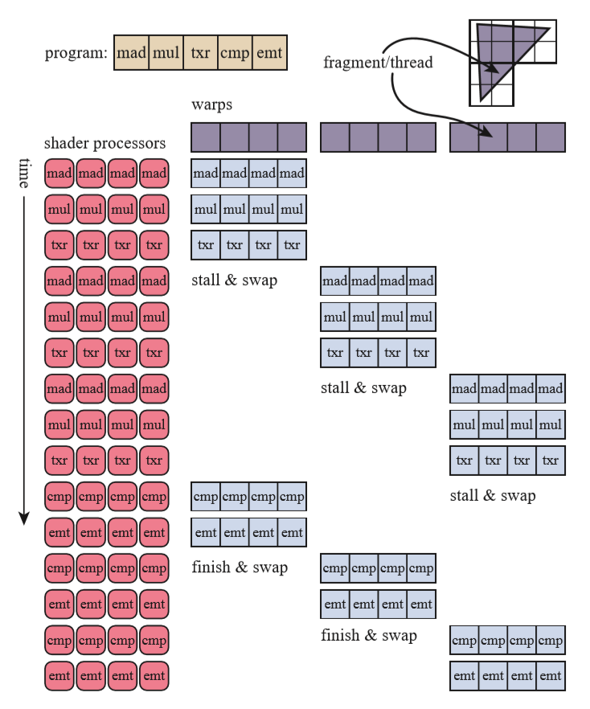
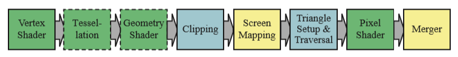
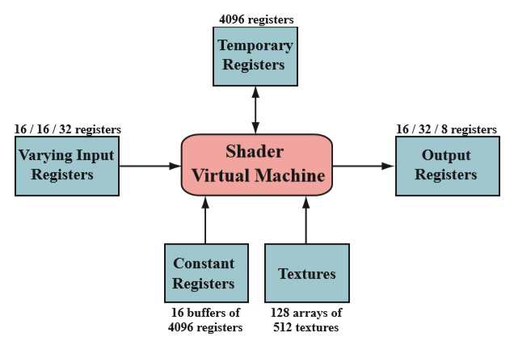
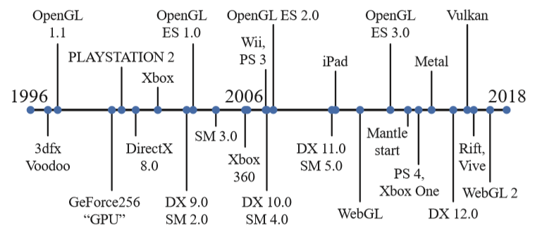

# 图形处理单元

[TOC]

## 引言

从颜色插值，显示到访问纹理数据，内建的`z-depth`可见性检查，越来越多的加速特性被添加到图形硬件中。专用的加速图形硬件和CPU相比的优势只在于速度，而速度对于图形处理来说是至关重要的。

在过去的二十年期间，图形硬件发生了巨大的变化。从固定功能管线，可配置管线到高度可编程管线，开发者可以更灵活的实现他们的算法。尽管出于效率上的考虑，管线的某些部分仍是可配置而不是可编程的，但总体的趋势朝着可编程性和灵活性迈进。

为了显著提升速度，GPU在高度可并行任务上做了相当的优化。比如，使用了定制的芯片来实现`z-buffer`,快速访问纹理，光栅化等等。下面的章节将会告诉你GPU怎么为可编程着色器实现平行化。

现在，只需要知道一个着色器核心(`shader core`)是一个小的处理器，它可以执行一些相对独立的任务，比如坐标转换。在图形处理的每帧中，有成千上万的三角形被发送到屏幕上，同时每秒也会激活上百万的着色器(`shader`)，也就是说，会产生同样数量的独立运行着色程序的实例。

首先，延迟(`latency`)是需要处理器都需要面临的问题。简单来说，信息离处理器越远，延迟越高。比如，访问内存上的数据就比寄存器的延迟高得多。要明白的一点是，由于等待数据取回造成的延迟会使得处理器被阻塞(`stalled`)，从而降低性能。

## 数据并行架构

不同的处理器架构采用不同的策略来避免拥堵。CPU被优化于处理种类广泛的数据结构和大规模的代码。尽管CPU可以有多个处理器，但每个处理器几乎是串行地运行代码，大大限制了`SIMD`的能力。

> 注：SIMD(single instruction, multiple data)指单指令多数据，是一类并行计算方式，这意味着拥有多个处理核心的处理器可以同时对多个数据执行相同的代码。

GPU采用不同的优化方法。GPU通常拥有大量的处理单元，也就是所谓的着色器核心(`shader core`)。GPU是一个流处理器，可以轮流的处理一系列相似的数据。由于数据的相似性（顶点/像素），GPU可以以大规模并行的方式去处理它们。一个关键的要素是调用要尽可能独立，数据之间不共享，否则会造成额外的延迟。

GPU专门为流量(`throughput`)进行优化，以尽可能快的处理更多数据。然而，由于更小的芯片面积限制，单个GPU的缓存和控制逻辑能力比CPU弱的多，因而对每个着色器核心来说，延迟问题也更加突出。

举个例子，当有两千个顶点需要着色时，假设GPU只有一个着色器核心，那么一个片元着色器会被调用两千次。当着色器需要执行譬如纹理获取的耗时操作时，就会被阻塞而不进行任何操作。

为了让GPU更加高效，可以给每个片元(`fragment`)的局部寄存器一点存储空间。如此，着色器就可以切换到下一个片元进行处理，而不是阻塞在当前片元上等到纹理获取完毕。重复这个过程，每当在当前片元发生耗时操作引起阻塞时，GPU立马切换到下一个片元继续工作，直到程序结束。通过切换片元的操作，可以使得GPU保持运转状态而巧妙的隐藏了延迟问题。虽然这样会使得每个片元的执行时间变长，但总体的效率却大大提升。

//TODO SIMD更进一步的工作方式。

|  |
| :-------------------------------------------------------: |
|               图 1：简化的的着色器执行例子                |

## GPU管线概览

|                |
| :----------------------------------------------------------: |
| 图 2：GPU渲染管线的实现。绿色：可编程；虚线：可选编程；黄色：可配置；蓝色：固定功能 |

如图2所示，GPU实现了第二章从概念上描述的几何处理，光栅化和像素处理管线阶段，这被划分为硬件级别的若干个阶段，每个阶段有不同程度的可配置性和可编程性。值得注意的是，上述的管线过程只是GPU的逻辑模型描述，而不一定是底层的GPU实现管线的流程，硬件层次的管线实现可能做更多的优化处理。

顶点着色器(`vertex shader`)是用来实现几何处理的完全可编程阶段。几何着色器(`geometry shader`)也是一个完全可编程的阶段，它对图元中的顶点数据进行操作，来销毁或创造新的图元。细分阶段(`tessellation stage`)和几何着色器都是可选的阶段，不一定被所有的GPU支持（特别是移动设备）。

裁剪(`clipping`)，三角形初始化和遍历(`triangle setup & traversal`)由固定管线硬件实现。屏幕映射(`screen mapping`)内部会根据窗口和视口状态进行简单的放缩和重定位操作。像素着色阶段也是完全可编程的。合并阶段支持高度配置，可以用来实现合并(`merging`)操作，比如修改颜色，z-buffer, 混合, 模板和其他跟输出相关的buffer。

## 可编程着色阶段

现代着色器程序使用了统一的设计。这意味着，顶点，像素，几何，细分相关的着色器共享着一样的编程模型和执指令集(`ISA`)，每个着色器核心可以用作不同的角色，而不是专用的像素着色器或顶点着色器。相同的编程模型使得GPU可以很好的分发任务，平衡负载。

GLSL(OpenGL)和HLSL(DX)是常见的着色器脚本语言。其中，HLSL可以被编译成中间表示的字节码。中间表示的字节码是平台无关，可以通过具体的GPU驱动转换成对应平台的ISA。

着色器支持的基本的数据类型有32位的单精度浮点数和向量。向量通常包含位置，法线，颜色等数据。整型通常用来表示索引，计数器，掩码。着色器同时也支持结构体，数组，矩阵这些聚合数据类型。

绘制调用(`draw call`)触发图形API绘制一组图元，从而使图形管线执行它的着色器。每个可编程着色器包含两种类型的输入：`uniform`输入和`varying`输入。`uniform`输入在一个`draw call`中不可改变，但可在`draw call`之间改变。`varying`输入数据来自三角形的顶点数据或者光栅化数据，是可变的输入数据。

底层的虚拟机给不同类型的输入输出提供不同的寄存器。为`uniform`提供的固定寄存器`constant register`远大于为可变的输入输出提供的寄存器。这是因为，每一个顶点或像素都需要单独存储可变的输入输出，这天然限制了这些寄存器的大小。而`uniform`输入在每一次`draw call`中只需要存储一次，并且为所有顶点或像素共享。此外，还有通用目的的临时寄存器`temporary register`。

|          |
| :----------------------------------------------------: |
| 图 3: Shader Model 4.0中的统一虚拟机架构和寄存器层次。 |

常用的操作，如加/乘/`atan()`/`log()`/矩阵乘法/归一化，在现代GPU中有着高效的实现。

if/else，loop这样的控制流(`flow control`)同样被着色器所支持。着色器支持静态控制流（基于`uniform`输入值）和动态控制流（基于`varying`输入）。静态控制流使得同样的着色器可以用在不同的场景中（如不同数量的光源），而不会导致线程分散(`thread divergence`)，因为在一个`draw call`中，固定的`unifrom`输入使得程序执行路径对每个线程来说都是固定的。动态控制流则会导致每个片元都可能以不同的程序路径执行代码，导致某些线程需要等待，并且同一个线程束的线程在等待过程中不能发生切换，影响性能。

> TIPS: 尽量避免shader中的分支语句可以提高性能。
>
> Ref: [thread divergence](https://cvw.cac.cornell.edu/gpu/thread_div)

## 可编程着色和API的发展

|  |
| :--------------------------------------------: |
|            图4: 图形API和硬件的发展            |

## 顶点着色器

## 细分阶段

## 几何着色器

## 像素着色器

## 合并阶段

## 计算着色器
