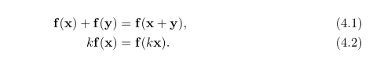
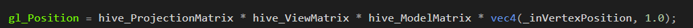
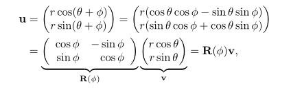
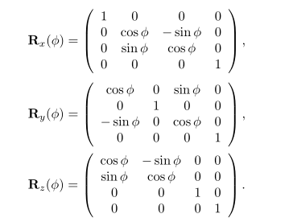
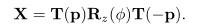
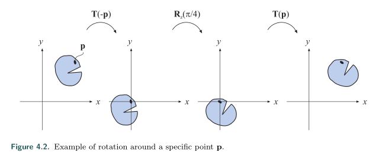
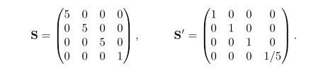
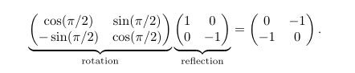
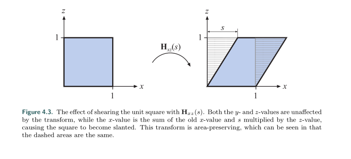
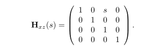

# Realtime-rendering变换

[TOC]

## 概念

​	变换就是以某种方式转换一些实体比如点，向量和颜色的操作，通过变换你可以对物体，光源和照相机做定位，重塑和动画。

​	线性变换有两个特性，一个是矢量加法，一个是标量乘法(这刚好是符合矩阵乘法运算的，所以我们一般使用矩阵乘法运算来实现缩放和旋转)。分别如下：

​	线性变换有两个种类，一个是缩放，一个是旋转，任何三个元素的向量，都可以使用3\*3的矩阵实现，通过3\*3的矩阵来乘以一个向量就可以缩放和旋转这个向量。

​	同理，对于任何一个两个元素的向量，都可以使用2\*2的矩阵来乘以这个向量来进行缩放和旋转。这里之所以举一个二维的例子，是因为二维的是在平面上，方便我们做图。

​	缩放，就是以一个对角阵左乘：

​	例如向量$(1,1)^T$，使用对角阵a左乘向量，就可以得到向量$（1,2）^T$。使用旋转矩阵b左乘就可以得到旋转后的向量$(-1,1)^T$。
$$
b = \left[
\matrix{
  cos90^° & -sin90^°\\
  sin90^° & cos90^°\\
}
\right]=
 \left[
\matrix{
  0 & -1\\
  1 & 0\\
}
\right]
$$

$$
a = \left[
\matrix{
  1 & 0\\
  0 & 2\\
}
\right]
$$
​	平移是指在一个固定向量上添加另一个向量，这并不是一个线性变换。比如线性变换f(x)=x+b。f(1)=1+b，f(2)=2+b，f(1+2)=3+b，前两者的和为3+2b，并不等于f(1+2)，这不满足4.1。

​	可以使用仿射变换(y=kx+b,x和b可以是向量)来结合线性变换和平移，即我们可以使用一个二维的矩阵乘法然后再使用一个二维的矩阵加法来实现二维的仿射变换。

​	再这里，为了更简单的理解，我们再降低一个维度，我们可以使用一个一维的矩阵乘法和一个一维的矩阵加法来完成一个y=kx+b(其中x和b是一维的向量)的仿射变换，除此之外，我们还可以使用一个二维的矩阵乘法来做到这一点。
$$
\left[
\matrix{
  y \\
  1 \\
}
\right]=
\left[
\matrix{
  k & b \\
  0 & 1 \\
}
\right]
\left[
\matrix{
  x \\
  1 \\
}
\right]
$$

​	基于这一点理由，我们为了统一图形学中的所有变换，旋转，缩放，平移，因此我们使用4维的矩阵来实现三维的变换。但是只有4维的向量能够参与4维矩阵的运算，因此，我们给现实世界的三维向量再添上一维，即齐次表达式来实现一个对应的4维向量。这还带来一个额外的好处，那就是我们可以更好的区分点(位置)和向量(方向)，向量就是形如a,点就是形如b。
$$
a = \left[
\matrix{
  x & y & z & 0 
}
\right]^T,
b = \left[
\matrix{
  x & y & z & 1 
}
\right]^T
$$

​	

## 基本变换

### 平移

​	假设现在有一个平移向量t=($t_x，t_y，t_z$)，我们对应生成的平移矩阵就是T(t)：
$$
T(t) = T(t_x，t_y，t_z)= \left[
\matrix{
  1 & 0 & 0 & t_x \\
  0 & 1 & 0 & t_y \\
  0 & 0 & 1 & t_z \\
  0 & 0 & 0 & 1 
}
\right]
$$

​	我们使用用这个T(t)去乘以b，就能得到新的点的坐标：

$$
b' = \left[
\matrix{
  x+t_x & y+t_y & z+t_z & 1 
}
\right]^T
$$

​	平移矩阵的逆就是向相反的方向平移同样的距离：$T^{-1}(t)=T(-t)$。

​	在图形学中，向量是不可以进行平移的，所以我们使用这个平移矩阵去乘以向量a，结果并不会有改变，但是对于其余的仿射变换，向量和点都有相同的效果。

​	需要注意的是，在有些API中，向量是行向量(row_major)，这样我们就要将向量放到乘号的左边，然后用向量去乘以变换矩阵，我们矩阵的使用顺序也是从左到右(DX)。

​	

​	上面的是我们在openGL中矩阵乘法的典型例子，向量放在最右边，然后根据矩阵的结合律，我们就会依次乘以模型，视图和投影矩阵。

### 旋转

​	旋转是通过给定一个点并且给定角度来旋转一个向量(点或者位置)的。它与平移一样都是属于刚体变换的，保留了点之间的距离，并且保留了点的偏手特性(不会左右交换)。

​	在二维空间中，旋转矩阵非常容易得到。假设一个二维向量v=$(u_x,u_y)^T=(rcos\theta，rsin\theta)^T$ ，现在我要将这个向量绕着原点逆时针旋转$\varphi$的角度，我们只需要在参数方程中将$\theta$变为$\theta+\varphi$即可，即$v'=(rcos(\theta+\varphi),rsin(\theta+\varphi))^T$ 。这样我们就能抽取出旋转矩阵了：

​	在三维空间中，我们需要绕着旋转轴旋转，x，y，z，因此有三个相对应的旋转矩阵：

​					

​	旋转矩阵的逆就是围着相反的角度旋转，即：$R_i^{-1}(\varphi) = R_i(-\varphi) $

​	现在我们考虑绕着某一点旋转，应该怎么做呢？为了简单起见，我们还是放在二维空间中讨论。假设我们绕着点p旋转，那么我们首先将点p移动与原点重合，再旋转物体，最后将点p移动到原来的位置上，当然，这些移动操作对物体也要做：

​	

​	

### 缩放

​	缩放矩阵(scaling matrix)，就是缩放x，y，z轴的矩阵，如果$s_x=s_y=s_z$,那么叫做等同向性(isotropic)缩放，如果不相同，叫做各向异性缩放(anisotropic)。也可以分别叫做均匀(uniform)缩放和不均匀(nouniform)缩放。

​	对于均匀缩放，我们可以有两种方式，一是在位置(0，0),(1，1),(2，2)都填充上相同的数字，二是在位置(3，3)上填充一个数字，其余三个位置为(1，1)。比如我们将某个向量扩大5倍，有下面两种方式。

​	如果我们的程序有测试齐次为是否为1(如果不为1才做除法)，那么使用s'会慢一点，如果没有这种测试的话，那么使用两种方式都是一样的。缩放矩阵的逆是将对角线上的位置元素(不含齐次项)变为其倒数。$S^{-1}(s)=S(1/s_x,1/s_y,1/s_z)​$。

​	在s类型的缩放矩阵当中，如果有一个或者三个元素是-1，那么这又叫做反射矩阵。将一个反射矩阵旋转过后得到的矩阵依然是一个反射矩阵。反射矩阵可以让逆时针绘制的顶点变成顺时针，这会导致不正确的渲染和不正确的背面剔除。我们检查一个矩阵是否是反射矩阵的做法是将正对角线上的元素乘起来，再减去负对角线上的元素乘起来的结果，如果是负数的话，就是反射矩阵。

​	如上图，将反射矩阵旋转过后，在等号右边的矩阵依然是一个反射矩阵，因为0*0-(-1\*(-1)）=-1。

​	之前我们讨论的都是按着x，y，z轴的缩放，如果我们按着一个任意方向来缩放的话，应该怎么办呢？我们假设我们绕着一个正交的右向矢量缩放：
$$
\left[\matrix{  f^x & f^y & f^z }\right]
$$
​	首先，与围绕空间中任意一点旋转类似，我们先将这三个矢量形成的坐标系统变换为一个标准的坐标系统，再做缩放，最后又变回去就好了。其中变换坐标系统的矩阵F是这样的。
$$
F=\left(\matrix{  f^x & f^y & f^z & 0\\
				0 & 0 & 0 & 1}\right)
$$

​	变换：$X=FS(s)F^T$。

​	

### 剪切

​	剪切矩阵一般是用来使游戏中的场景扭曲，来造成一种迷幻效果，或者是扭曲一个物体的表面。有6种类型的剪切矩阵，分别用符号表示为：$H_{xy}(s),H_{xz}(s),H_{yx}(s),H_{yz}(s),H_{zx}(s),H_{zy}(s)$ 。我们来看一下xz下标类型的剪切：

​	xz类型的剪切，其中对于原物体上的坐标，只有x的坐标会有所改变(x的新坐标为x的老坐标加上对应的z乘以s)，而且我们可以看到右边的平行四边形的面积等于左边的矩阵。我们使用0,1,2看作x，y，z轴的索引那么根据下标的类型，我们就能够找到对应的s在剪切矩阵中的位置，如$H_{xz}(s)$。x代表0，z代表2，那么位置(0，2)中的就是s。

​	我们使用这个剪切矩阵乘以一个点p就能够得到一个新的点$p'=(p_x+sp_z,p_y,p_z,1)^T​$。剪切矩阵$H_{ij}(s)​$

的逆就是在相同轴上做相反的剪切即：$H^{-1} _{ij}(s)=H_{ij}(-s)$ 。剪切矩阵的行列式始终为1，因此这是一个保持体积的变换，即物体做了剪切变换以后，体积不变。

​	

