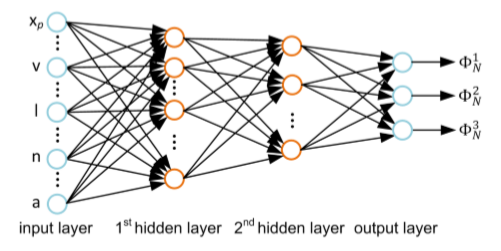
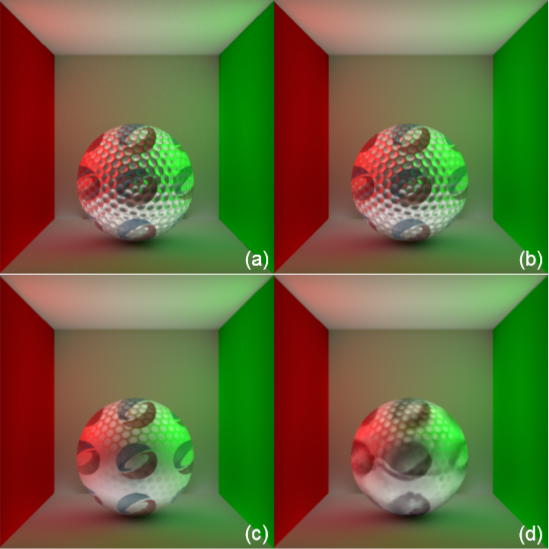

# Notes on "Global Illumination with Radiance Regression Functions"

## Brief description of the research

*(background, Insight and main idea)*

全局光照效果由直接光照和间接光照构成。直接光照部分很好求解，但间接光照部分需要考虑光线在场景中的多次传输/反射问题。这导致了间接光照的求解非常复杂，使用类似Path Tracing的方法求解可以得到非常精确的光照效果，但效率非常低，通常用于离线渲染；使用类似立即辐射度方法求解可以近似真实光照，同时提高计算效率。

论文首次提出了使用机器学习方法来对全局光照的间接光照部分进行预测，本质上是一种预计算的技术。通过使用精确的全局光照算法(如Path Tracing)进行数据采集，理论上可以使得训练的模型可以既实现Path Tracing的全局光照效果(caustics和high-frequency glossy inter-reflections)的同时，在渲染阶段也能保证实时效果。

机器学习模型可以看做是存在解析解的非线性函数，在论文中用来拟合复杂的无解析解的反射方程的间接光照部分。

## Problems and solutions

(*problems that need to be solved and the authors' solutions*)

- 选择什么样的机器学习模型？

  理论上，拥有一个隐藏层的神经网络可以拟合任意阶函数。而神经网络恰好可以表征这种复杂的非线性映射关系。Hornik et al.指出前馈神经网络可以很好的逼近有限域内的连续函数，而间接光照函数属于这一类函数。

  作者认为超过两个隐藏层的神经网络难以训练，只包含一个隐藏层的神经网络需要大量的结点。因此选择了包含两个隐藏层的前馈神经网络。在结点的选择上，作者在附录中给出了实验证明，隐藏层结点的增多可以减少训练误差，但是也带来了更大的计算代价。

  因此，综合考虑，选择了适中的结点数量，来使得网络结构尽可能紧凑而提高预测效率和训练代价。loss function选择了常用的最小平方误差。

  |  |
  | :----------------------------------------------------------: |
  |                图1：文中使用的神经网络结构。                 |

- 如何构建有效的特征？

  根据绘制方程，间接光照的特征是由着色点的位置$\mathbf{x}_p$，视点方向$\mathbf{v}$，点光源的位置 $\mathbf{l}$ 唯一确定。但是由于对机器学习模型而言，由这些基本属性构成的特征向量与响应值构成的高度复杂的非线性映射关系会令模型难以学习。

  因此，作者提出了将额外的特征（表面法线$\mathbf{n}$和反射率$\mathbf{a}$）加入到原始基本特征中，构成最终的增强特征 $\Phi(\mathbf{x}_p,\mathbf{v},\mathbf{l},\mathbf{n},\mathbf{a})$。响应值则是间接光照颜色的三个RGB分量。

  作者认为，通常加入新的特征会增大输入空间，而使得训练变得更为困难。但是对于表面法线和反射率而言，它们是可以通过原始特征$\mathbf{x}_p$推断得到，因而本质上输入的维度并没有增大，反而是起到了在更高维度的空间下对原始特征进行简化的效率，是对原始特征的一种embedding。

  |  |
  | :----------------------------------------------------------: |
  | 图2：a) 使用路径跟踪的ground truth  b) 加入法线和反射率 c) 仅加入反射率 d) 只包含原始特征 |

- 如何有效的采集训练数据？

  论文实现了使用基于物理的path tracing全局光照算法，在渲染过程中对特征量和响应值进行采样。通常，尽可能大的训练集可以使模型产生更好的拟合效果，但是在实际中，需要对训练集的大小进行限制，因为误差函数的复杂度会随着训练集大小增大而难以优化。

  对于Cornell模型，作者使用了5.6MB的训练数据进行神经网络训练，对比其他的预计算算法的需求量更少。

  文中没有提到的是，数据集的采集方式，是否用到了场景的先验。很容易想到的一点是，对于场景中的平滑区域，采样的密度可以更低。同时，采样的范围是否有所约束，对未采样或少采样的区域的预测效果也没有提及。

- 如何有效地利用训练数据？

  文中提出了两种有效利用训练数据的方法。

  1. 加入增强特征，减小训练难度
  2. 将输入的特征向量空间进行划分，为每个子空间训练一个单独的模型。

- 如何提高预测效率？

  限制网络模型规模等

- 是否存在针对3D场景的优化？结合某些先验是否会使得问题变简单？

  论文中未体现

- 怎么适应复杂场景？

  场景分割，对每一个子场景训练一个模型

- 怎么适应不同场景？

  未提及，目测很难，需要针对不同的场景训练不同的网络模型。

- 怎么适应动态场景？

  很难，动态场景使得场景复杂度/自由度大幅升高。只能加入一些变化维度很低的动态场景。

